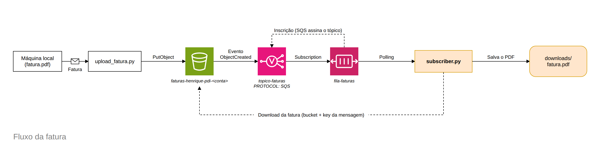

# Pipeline de Faturas na AWS

Programa em Python que pega uma fatura em PDF da máquina, sobe pro S3 e, quando o
arquivo chega lá, outra parte do código é avisada, acha a fatura e baixa de volta.
A conversa entre as duas partes passa por SNS e SQS.



## Como funciona

São duas partes separadas: uma que envia a fatura (produtor) e outra que reage quando
chega fatura nova (consumidor). Uma não conhece a outra, elas falam pela fila.

O caminho completo:

```
fatura.pdf -> S3 -> (evento) -> SNS -> SQS -> subscriber.py -> downloads/fatura.pdf
```

Passo a passo:

1. `upload_fatura.py` sobe a fatura pro bucket S3.
2. O S3 percebe o arquivo novo e dispara um evento, sozinho, pro tópico SNS.
3. O SNS joga essa notificação na fila SQS (que está inscrita no tópico).
4. `subscriber.py` fica consultando a fila; quando chega mensagem, lê o endereço da
   fatura no S3 e baixa o arquivo.

## Papel de cada serviço

- **S3**: guarda a fatura num bucket. Quando recebe um arquivo novo, dispara um evento.
- **SNS**: é o tópico (modelo publica/assina). Recebe o evento do S3 e repassa para quem
  estiver inscrito.
- **SQS**: fila inscrita no tópico. Segura a mensagem até alguém processar.
- **Python (boto3)**: o produtor (envia) e o consumidor (ouve a fila e baixa).

### Por que usar SNS e SQS juntos

O SNS sozinho precisaria chamar um endereço HTTP público para entregar a mensagem, o que
não dá pra fazer com um script rodando na minha máquina. Colocando uma fila SQS no meio,
o consumidor só precisa consultar a fila quando quiser, sem expor nenhuma porta. Além
disso, se o consumidor estiver desligado, a mensagem fica guardada na fila esperando.

### O que vai na mensagem (payload)

A notificação carrega o endereço da fatura no S3: o nome do bucket e a key (caminho do
arquivo). É com isso que o consumidor sabe qual arquivo buscar. O evento do S3 já traz
esses campos prontos:

```json
{
  "Records": [
    { "s3": { "bucket": { "name": "meu-bucket" },
              "object": { "key": "fatura.pdf" } } }
  ]
}
```

## Arquivos

```
config.py           configurações e clientes boto3
infra_setup.py      cria e conecta bucket + tópico + fila (roda uma vez)
upload_fatura.py    produtor: lê a fatura local e envia ao S3
subscriber.py       consumidor: ouve a fila, lê a mensagem e baixa a fatura
faturas/            faturas de entrada (coloco o PDF aqui)
downloads/          onde a fatura baixada é salva
docs/               imagens (diagrama do fluxo)
```

## Como rodar

Preciso de Python 3.10+, uma conta AWS e um usuário IAM com acesso a S3, SNS e SQS.

```bash
# ambiente virtual
python3 -m venv .venv
source .venv/bin/activate

# dependências
pip install -r requirements.txt awscli

# credenciais da AWS (access key do usuário IAM, região, formato json)
aws configure

# configuração do projeto: copio o modelo e troco o nome do bucket
cp .env.example .env
```

O bucket precisa ter um nome único no mundo, então uso algo como
`faturas-<seu-nome>-<numero-da-conta>`.

Depois, na ordem:

```bash
# 1) cria a infraestrutura na AWS (uma vez só)
python infra_setup.py

# 2) num terminal, deixo o consumidor ouvindo
python subscriber.py

# 3) noutro terminal, envio a fatura
python upload_fatura.py faturas/fatura_exemplo.pdf
```

No terminal do consumidor aparece a linha do download e o arquivo cai na pasta
`downloads/`.

## Limpando os recursos

Para não deixar nada criado na conta depois dos testes, dá pra apagar pelo console da
AWS ou pela linha de comando:

```bash
aws s3 rb s3://SEU_BUCKET --force
aws sns delete-topic --topic-arn arn:aws:sns:us-east-1:CONTA:topico-faturas
aws sqs delete-queue --queue-url https://sqs.us-east-1.amazonaws.com/CONTA/fila-faturas
```
